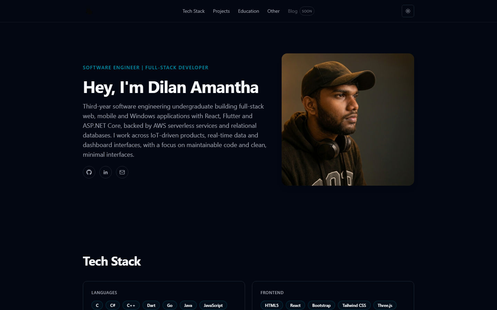

# lynx_portfolio

A personal portfolio website built as a single-page React application. It presents an introduction, tech stack, projects, education and other skills, with light and dark themes and an animated background.

## Tech Stack

- React 18 with TypeScript
- Vite 6 for development and builds
- Tailwind CSS 3 with `tailwindcss-animate`
- Framer Motion for animations
- Lucide React for icons
- `clsx`, `tailwind-merge` and `class-variance-authority` for class composition

## Project Structure

```
public/img/            Static images (profile, icon)
src/
  main.tsx             Application entry point
  App.tsx              Page layout and section order
  index.css            Tailwind layers and theme CSS variables
  components/          Page sections (Navbar, Hero, TechStack, Projects, Education, Other)
  components/ui/       Reusable UI pieces (animated background paths)
  data/site.ts         Typed site content: personal info, links, tech stack, projects
  lib/useTheme.ts      Light/dark theme hook persisted to localStorage
  lib/utils.ts         Class name helper
```

Site content is kept in `src/data/site.ts`, so text, links and projects can be updated without editing the components. The `@` import alias resolves to `src/`.

## Getting Started

Requires Node.js 18 or later.

```bash
npm install
npm run dev
```

## Scripts

| Command           | Description                              |
| ----------------- | ---------------------------------------- |
| `npm run dev`     | Start the Vite development server        |
| `npm run build`   | Type-check and build to `dist/`          |
| `npm run preview` | Serve the production build locally       |
| `npm run lint`    | Run ESLint                               |

## Preview


